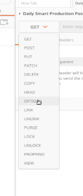

- [CHECKPOINT 6](#checkpoint-6)
  - [1. Introducción](#1-introducción)
  - [2. Programación orientada a objetos: Clases en Python](#2-programación-orientada-a-objetos-clases-en-python)
  - [3. Método `__init__`](#3-método-__init__)
  - [4. ¿Qué son los Dunder Methods o métodos Dunder?](#4-qué-son-los-dunder-methods-o-métodos-dunder)
    - [`__init__` → Constructor](#__init__--constructor)
    - [`__str__` → Representación para humanos](#__str__--representación-para-humanos)
    - [`__repr__` → Representación para desarrolladores](#__repr__--representación-para-desarrolladores)
    - [`__len__` → Longitud con len()](#__len__--longitud-con-len)
    - [`__eq__` → Igualdad con ==](#__eq__--igualdad-con-)
    - [`__lt__`, `__gt__`, `__le__`, `__ge__` → Comparaciones](#__lt__-__gt__-__le__-__ge__--comparaciones)
    - [`__add__` → Suma con +](#__add__--suma-con-)
    - [`__contains__` → Pertenencia con in](#__contains__--pertenencia-con-in)
    - [`__getitem__` y `__setitem__` → Acceso con corchetes \[\]](#__getitem__-y-__setitem__--acceso-con-corchetes-)
    - [`__del__` → Destructor](#__del__--destructor)
    - [Tabla resumen de algunos Dunder Methods](#tabla-resumen-de-algunos-dunder-methods)
  - [5. ¿Qué es un decorador en Python?](#5-qué-es-un-decorador-en-python)
    - [Decoradores de frameworks](#decoradores-de-frameworks)
  - [6. ¿Qué es Polimorfismo?](#6-qué-es-polimorfismo)
  - [7. ¿Qué es una API?](#7-qué-es-una-api)
    - [¿Cómo se utilizan las API?](#cómo-se-utilizan-las-api)
    - [Cómo funcionan las API](#cómo-funcionan-las-api)
    - [Tipos de API](#tipos-de-api)
    - [Algunos ejemplos cotidianos de API](#algunos-ejemplos-cotidianos-de-api)
  - [8. ¿Cuáles son los tres verbos de API?](#8-cuáles-son-los-tres-verbos-de-api)
    - [Método GET → Obtener información](#método-get--obtener-información)
    - [Método POST → Crear información](#método-post--crear-información)
    - [Método PUT → Reemplazar completamente](#método-put--reemplazar-completamente)
    - [Método DELETE → Eliminar información](#método-delete--eliminar-información)
  - [9. ¿Qué es Postman?](#9-qué-es-postman)
  - [10. ¿Es Mongo una base de datos SQL o NoSQL?](#10-es-mongo-una-base-de-datos-sql-o-nosql)
    - [¿Que problema resuelve Mongo?](#que-problema-resuelve-mongo)
    - [Diferencias entre SQL y NoSQL](#diferencias-entre-sql-y-nosql)
    - [¿Cuándo usar cada uno?](#cuándo-usar-cada-uno)


## 1. Introducción

La programación Orientada a Objetos es un estilo de programación que organiza y estructura el código de una determinada forma. En vez de centrarse únicamente en la lógica del programa, este enfoque se centra en el concepto de clases y objetos.

Con esta estructura, el programa se construye mediante pequeñas piezas que facilitan la reutilización y el aprovechamiento del código, por eso es tan importante conocerlo y aplicarlo.

El objetivo de la POO es cambiar la manera en la que pensamos los programas. En vez de imaginarnos únicamente funciones o algoritmos, lo que se busca con la POO es identificar objetos y entender cómo se relacionan entre sí.

Es relevante sobre todo en proyectos grandes, dado que al visualizar el todo como un conjunto de entidades, facilita el diseño y el mantenimiento del código.

Además fomenta buenas prácticas como evitar la duplicación innecesaria. Gracias a conceptos como la encapsulación y la abstracción, protege los datos internos de los objetos y simplifica la forma de interactuar con ellos.

La Programación Orientada a Objetos se ha convertido en uno de los paradigmas más utilizados en la actualidad, por todas sus ventajas. Por eso es importante conocerla para desarrollarla en los proyectos reales. 

## 2. Programación orientada a objetos: Clases en Python

 En síntesis, la programación orientada a objetos (en adelante POO) es una forma de organizar el código que imita cómo pensamos. Por ejemplo, un usuario tiene nombre, email y contraseña — y puede iniciar sesión, cambiar su perfil o darse de baja. Esos datos y esas acciones van juntos. Una `clase` los agrupa en un solo lugar.

Python es un lenguaje multiparadigma porque permite programar con funciones, con clases, o mezclar ambas según lo que cada parte del proyecto necesite. Por ello entender la POO es indispensable porque toda la biblioteca estándar y los frameworks más usados están construidos sobre `clases`. 

Una `clase` se puede comparar con un molde, una plantilla o un plano para crear algo. Por sí sola no es nada concreto, pero sirve para crear cosas concretas.

Pensemos una clase como el plano arquitectónico de una casa. El plano no es una casa, pero con él puedes construir todas las casas que quieras. Cada casa construida con el plano `clase` es un objeto.

Cosas de lo más cotidianas como un perro o un coche pueden ser representadas con clases. Estas clases tienen diferentes características, que en el caso del perro podrían ser la edad, el nombre o la raza y se establecen como `variables` dentro de una clase. Llamaremos a estas características, `atributos`.

Por otro lado, las clases tienen un conjunto de funcionalidades o cosas que pueden hacer. En el caso del perro podría ser andar o ladrar. Llamaremos a estas funcionalidades `métodos`.

Por último, pueden existir diferentes tipos de perro. Podemos tener uno que se llama Toby o el del vecino que se llama Laika. Llamaremos a estos diferentes tipos de perro `objetos`. Es decir, el concepto abstracto de perro es la `clase`, pero Toby o cualquier otro perro particular será el objeto.

La sintaxis básica es: 
```
`class` → palabra reservada para crear clases, seguida de:

NombreDeClase → normalmente se escribe en PascalCase.
``` 

***PascalCase*** es una convención de nomenclatura de programación donde todas las palabras que componen un nombre se escriben unidas, comenzando cada una con una letra mayúscula y sin espacios ni guiones, a diferencia del camelCase, donde se escribe la primera letra en minúscula, por ejemplo para definir variables. 

Veamos cómo quedaría estrucutrada la clase con el ejemplo del perro:

```python
class Perro:

    def __init__(self, nombre, edad): # al crear un objeto desde una clase, Python automáticamente llama a un método llamado __init__ , mediante el cual se asignan  características iniciales a dicho objeto. 

        self.nombre = nombre #guarda el nombre del perro
        self.edad = edad #guarda la edad del perro

```

En el ejemplo anterior observamos que para pasar un argumento predeterminado a cualquier función de una clase, utilizamos `self`. Siempre que creamos una función dentro de una clase, debemos pasar `self` como primer argumento.


**Instanciar** es como se denomina a la manera de llamar a una clase, de la misma manera en que se llama a una función. Podemos usar el nombre que consideremos más adecuado para crear la variable, que a su vez nos permitirá instanciar una clase. Vamos a instanciar nuestra `clase` Perro: 

```python
class Perro:
    pass

mi_perro = Perro() #aquí estamos creando un OBJETO para la clase Perro, que se denomina mi_perro.
```

Continuamos con el ejemplo de la clase Perro, a la que asignamos los atributos: nombre y edad. En el ejemplo siguiente vemos cómo instanciar el objeto perro, con sus características o atributos que son un nombre definido y edad. 

```python
class Perro:

    def __init__(self, nombre, edad):
        self.nombre = nombre
        self.edad = edad

mi_perro = Perro("Max", 5) #aquí llamamos al objeto o instanciamos al objeto, que en este caso es mi_perro

print(mi_perro.nombre) # Max
print(mi_perro.edad) # 5
```

Por último, las clases también pueden contener funciones, llamadas métodos. Siguiendo con el ejemplo del perro tenemos: 

````python
class Perro:

    def __init__(self, nombre):
        self.nombre = nombre

    def ladrar(self): #aplicamos el método ladrar
        print("Guau!")

mi_perro = Perro("Max")

mi_perro.ladrar()

````
En conclusión, en POO son fundamentales estos tres pasos: 

1️⃣ Definir la clase

2️⃣ Crear el objeto (instancia)

3️⃣ Usar métodos y atributos del objeto. 


Aquí un esquema básico que explica las clases en Python: 

```text
CLASE (molde o plano)
│
├── __init__()  →  define las características del objeto creado a partir de la clase.
├── método1()   →  comportamiento 1
└── método2()   →  comportamiento 2
        │
        │  crear objetos con  NombreClase()
        │
   ┌────┴────┐
objeto1    objeto2
(sus propios datos, comportamientos compartidos)
````

**IMPORTANTE:**

Es importante diferenciar dos conceptos cuando se construye una clase: *atributos de clase* y *atributos de instancia*. 

Por una parte, los *atributos de clase* pertenecen a la clase en sí misma, no a ningún objeto en particular. Todos los objetos comparten el mismo valor, y se definen fuera de __init__, directamente en el cuerpo de la clase. 

Por otra parte, los *atributos de instancia* pertenecen exclusivamente a cada objeto. Cada instancia tiene su propia copia, completamente independiente de las demás.
Se definen siempre dentro de __init__ usando self. 

En el siguiente código se muestra con más claridad la diferencia entre ambos: 

```python
class Perro:
    especie = "Canis lupus familiaris"   # atributo de clase
    patas = 4                            # atributo de clase

    def __init__(self, nombre):
        self.nombre = nombre             # atributo de instancia


perro1 = Perro("Rex")
perro2 = Perro("Luna")

# Todos los perros comparten los atributos de clase
print(perro1.especie)   # Canis lupus familiaris
print(perro2.especie)   # Canis lupus familiaris
print(Perro.especie)    # Canis lupus familiaris ← también accesible desde la clase
````

## 3. Método `__init__`

Como ya hemos visto, `__init__` es un método especial (también llamado constructor) que se ejecuta automáticamente cuando creamos un objeto a partir de una clase.

El método `__init__` son las iniciales de "initialize" en inglés. Siguiendo este concepto, sirve para "inicializar" los atributos del objeto.

Por tanto, `__init__` no es “un método cualquiera”.

Es el mecanismo que transforma un molde abstracto en un objeto concreto con estado propio. Este método configura el objeto, NO lo crea. 

Dicho de otra forma, el método `__init__` tiene como funciones: 

* Inicializar el objeto,
* Asignar valores iniciales,
* Preparar sus atributos internos.

La sintaxis, una vez creada la clase, se establece como una función: 

```python
class Persona:

    def __init__(self, nombre, edad):
        self.nombre = nombre
        self.edad = edad
``` 
Podríamos afirmar que el método `__init__`es el principal de los Dunder Methods. 

## 4. ¿Qué son los Dunder Methods o métodos Dunder?

Dunder viene de **D**ouble **under**score (doble guion bajo en inglés). Son métodos especiales que Python reconoce automáticamente, como el método constructor visto anteriormente: `__init__`.

Los Dunder Methods sirven para que los objetos personalizados se comporten como los tipos nativos de Python (números, listas, strings...). Es decir, para que se puedan hacer cosas como:

```python
perro1 + perro2  # sumar objetos
len(mi_objeto)   # medir un objeto
print(mi_objeto) # imprimir un objeto de forma legible.
perro1 == perro2 # comparar objetos
```

A continuación se presenta una lista de los métodos Dunder más usados: 

### `__init__` → Constructor
Se llama automáticamente al crear un objeto:
```python
class Perro:
    def __init__(self, nombre, edad):
        self.nombre = nombre
        self.edad = edad

perro = Perro("Rex", 3)   # Python llama a __init__ automáticamente
```

### `__str__` → Representación para humanos

Se llama cuando usas print() o str() sobre un objeto. Define cómo se muestra tu objeto de forma legible para personas:
```python

class Perro:
    def __init__(self, nombre, edad):
        self.nombre = nombre
        self.edad = edad

    def __str__(self):
        return f"Perro llamado {self.nombre} de {self.edad} años"

perro = Perro("Rex", 3)
print(perro)   # Perro llamado Rex de 3 años
print(str(perro)) # Perro llamado Rex de 3 años
```

Sin `__str__`, print(perro) mostraría algo feo como `<__main__.Perro object at 0x7f3a1b2c>`.

### `__repr__` → Representación para desarrolladores
Similar a __str__, pero su objetivo es mostrar una representación técnica y detallada, útil para depurar código. es muy parecido a Dunder String, con la diferencia clave de que Dunder Repr se usa generalmente para la salida sin formato. Se utiliza para, por ejemplo, enviar información a los registros o a un registro de errores. La convención es que el resultado parezca código Python válido:

```python
class Perro:
    def __init__(self, nombre, edad):
        self.nombre = nombre
        self.edad = edad

    def __str__(self):
        return f"Perro: {self.nombre}"

    def __repr__(self):
        return f"Perro(nombre='{self.nombre}', edad={self.edad})"


perro = Perro("Rex", 3)
print(str(perro))    # Perro: Rex         ← para el usuario
print(repr(perro))   # Perro(nombre='Rex', edad=3)  ← para el desarrollador
```


### `__len__` → Longitud con len()
Se llama cuando usas len() sobre tu objeto:
```python
class Carrito:
    def __init__(self):
        self.productos = []

    def añadir(self, producto):
        self.productos.append(producto)

    def __len__(self):
        return len(self.productos)


carrito = Carrito()
carrito.añadir("Manzanas")
carrito.añadir("Pan")
carrito.añadir("Leche")

print(len(carrito))   # 3
```

### `__eq__` → Igualdad con ==
Define qué significa que dos objetos sean iguales. Sin este método, == compara si son el mismo objeto en memoria, no si tienen los mismos datos:
```python
class Punto:
    def __init__(self, x, y):
        self.x = x
        self.y = y

    def __eq__(self, otro):
        return self.x == otro.x and self.y == otro.y


p1 = Punto(3, 5)
p2 = Punto(3, 5)
p3 = Punto(1, 2)

print(p1 == p2)   # True  ← mismas coordenadas
print(p1 == p3)   # False ← coordenadas distintas
```
Sin `__eq__`, p1 == p2 daría False porque son objetos distintos en memoria aunque tengan los mismos datos.

### `__lt__`, `__gt__`, `__le__`, `__ge__` → Comparaciones

Permiten usar los operadores <, >, <=, >= entre objetos:
```python
class Producto:
    def __init__(self, nombre, precio):
        self.nombre = nombre
        self.precio = precio

    def __lt__(self, otro):     # less than: menor que
        return self.precio < otro.precio

    def __gt__(self, otro):     # greater than: mayor que
        return self.precio > otro.precio

    def __str__(self):
        return f"{self.nombre} ({self.precio}€)"


p1 = Producto("Café", 2.5)
p2 = Producto("Zumo", 3.0)

print(p1 < p2)    # True
print(p1 > p2)    # False

# Incluso puedes ordenar una lista de objetos
productos = [Producto("Zumo", 3.0), Producto("Café", 2.5), Producto("Agua", 1.0)]
productos_ordenados = sorted(productos)

for p in productos_ordenados:
    print(p)
# Agua (1.0€)
# Café (2.5€)
# Zumo (3.0€)
```

### `__add__` → Suma con +

Define qué pasa cuando sumas dos objetos con +:
```python
class Vector:
    def __init__(self, x, y):
        self.x = x
        self.y = y

    def __add__(self, otro):
        return Vector(self.x + otro.x, self.y + otro.y)

    def __str__(self):
        return f"Vector({self.x}, {self.y})"


v1 = Vector(1, 2)
v2 = Vector(3, 4)

resultado = v1 + v2   # Python llama a v1.__add__(v2)
print(resultado)      # Vector(4, 6)
```

De forma similar existen `__sub__` para la resta (-), `__mul__` para multiplicar (*), `__truediv__` para dividir (/).

### `__contains__` → Pertenencia con in

Define qué pasa cuando usas el operador in:
```python
class Biblioteca:
    def __init__(self):
        self.libros = []

    def añadir(self, libro):
        self.libros.append(libro)

    def __contains__(self, libro):
        return libro in self.libros


biblioteca = Biblioteca()
biblioteca.añadir("Don Quijote")
biblioteca.añadir("El Principito")

print("Don Quijote" in biblioteca)    # True
print("Harry Potter" in biblioteca)   # False
``` 

### `__getitem__` y `__setitem__` → Acceso con corchetes []

Permiten acceder y modificar elementos de tu objeto como si fuera una lista o diccionario:
```python
class Inventario:
    def __init__(self):
        self.items = {}

    def __setitem__(self, clave, valor):    # inventario["manzanas"] = 10
        self.items[clave] = valor

    def __getitem__(self, clave):           # inventario["manzanas"]
        return self.items[clave]


inventario = Inventario()
inventario["manzanas"] = 50    # llama a __setitem__
inventario["peras"] = 30

print(inventario["manzanas"])  # 50  ← llama a __getitem__
print(inventario["peras"])     # 30
``` 

### `__del__` → Destructor

Se llama automáticamente cuando un objeto va a ser eliminado de memoria:

```python

class ConexionBD:
    def __init__(self, url):
        self.url = url
        print(f"Conexión abierta a {self.url}")

    def __del__(self):
        print(f"Conexión cerrada a {self.url}")


conexion = ConexionBD("localhost:5432")
#Conexión abierta a localhost:5432

del conexion
#Conexión cerrada a localhost:5432
```

### Tabla resumen de algunos Dunder Methods

| Dunder Method | Se activa con... | Uso típico |
|---|---|---|
| `__init__` | `Clase()` | Inicializar el objeto |
| `__str__` | `print()`, `str()` | Texto legible para usuarios |
| `__repr__` | `repr()`, consola | Texto técnico para desarrolladores |
| `__len__` | `len()` | Longitud del objeto |
| `__eq__` | `==` | Comparar igualdad |
| `__lt__` | `<` | Comparar menor que |
| `__gt__` | `>` | Comparar mayor que |
| `__add__` | `+` | Sumar objetos |
| `__sub__` | `-` | Restar objetos |
| `__mul__` | `*` | Multiplicar objetos |
| `__contains__` | `in` | Comprobar pertenencia |
| `__getitem__` | `objeto[clave]` | Leer con corchetes |
| `__setitem__` | `objeto[clave] = valor` | Escribir con corchetes |
| `__del__` | `del objeto` | Destruir el objeto |

## 5. ¿Qué es un decorador en Python?

Los decoradores (decorators) son una característica avanzada de Python que permite modificar, extender o envolver el comportamiento de una función o clase sin cambiar directamente su código original. En otras palabras, un decorador es una función que envuelve a otra función para añadirle comportamiento extra, sin modificar su código interno. Se escribe con `@` justo encima de la función, aunque también se pueden usar decoradores sin `@`.

Ejemplo manual:

```python

def decorador(func):

    def wrapper():
        print("Antes")
        func()

    return wrapper


def saludar():
    print("Hola")


saludar = decorador(saludar)

saludar()

Resultado:

Antes
Hola
``` 

Ambos formatos se utilizan, pero usar el arroba antes del decorador es mejor práctica porque es más limpio, más corto, más legible, y es el estándar en Python.

Prácticamente todo el código profesional usa @.

Probablemente el decorador más importante en POO para quienes se están iniciando en Python es `@property`, porque convierte un método en un atributo.

El decorador `@property`se usa a menudo para:

* Controlar acceso a atributos.
* Validar datos.
* Ocultar una lógica interna.
* Mantener una sintaxis limpia.

Veamos un ejemplo sin decorador @property:

```python

class Persona:

    def __init__(self, nombre):
        self.nombre = nombre

    def obtener_nombre(self):
        return self.nombre


persona = Persona("Ana")

print(persona.obtener_nombre())
``` 
El mismo ejemplo con @property:

```python
class Persona:

    def __init__(self, nombre):
        self._nombre = nombre

    @property
    def nombre(self):
        return self._nombre


persona = Persona("Ana")

print(persona.nombre)

``` 
Otros decoradores, en los que no profundizaremos en esta ocasión, son: `@staticmethod`, `@classmethod`, `@dataclass` (considerados decoradores internos), y `@wraps` (usado para preservar la función original).

### Decoradores de frameworks

En Python más avanzado veremos también decoradores constantemente, por ejemplo en los frameworks. Aquí algunos ejemplos: 

***Flask***
```
@app.route("/")
```

Registra rutas web.

***FastAPI***

```
@app.get("/")
```

Define endpoints API.

***Django***
```
@login_required
````

Verifica autenticación.

En los ejemplos anteriores hemos visto algunos de los decoradores utilizados en frameworks. De la misma manera que en una clase, los decoradores usaos en frameworks permiten: 

* Añadir comportamiento automáticamente,
* Registrar funciones,
* Configurar sistemas sin modificar el código interno.

En resumen, los decoradores modifican dinámicamente la funcionalidad de una *función*, *método* o *clase*, incluso un *framework*, sin tener que utilizar directamente subclases ni cambiar el código fuente de la función que se está decorando. Utilizar decoradores en Python también garantiza que tu código sea DRY(Don't Repeat Yourself). 

## 6. ¿Qué es Polimorfismo?

La programación orientada a objetos nos permite crear clases que pueden ***heredar*** propiedades, métodos y comportamientos de otras clases ya existentes. En Python, la herencia es una característica clave que nos permite crear clases hijas a partir de una clase padre.

La ***herencia*** en Python se logra por medio de una sintaxis sencilla que involucra la creación de una nueva clase que hereda atributos y métodos de la clase padre. Para crear una clase hija en Python, simplemente agregamos el nombre de la clase padre en paréntesis después del nombre de la clase hija.

El ***polimorfismo***, a su vez, permite utilizar objetos de diferentes clases de manera intercambiable. Esto significa que el mismo método o función puede ser utilizado en diferentes tipos de objetos, sin preocuparnos por conocer los detalles exactos de cada uno de ellos. En Python, el ***polimorfismo*** está estrechamente relacionado con la ***herencia*** y la superposición de métodos.

Polimorfismo es un término utilizado en Python para referirse a la capacidad de un objeto para adoptar múltiples formas. El término se deriva de dos términos distintos: poli, que significa numerosos, y morfos, que significa formas.

El polimorfismo es una técnica de la programación orientada a objetos que permite a distintos objetos responder de manera diferente a un mismo llamado de método. En Python, esto se logra gracias al uso de clases y funciones, lo que aumenta significativamente la flexibilidad de nuestras implementaciones.

Una de las ventajas del polimorfismo es que nos permite escribir código más genérico, lo que a su vez nos permite reutilizar nuestro código en una variedad de situaciones.

Veamos un ejemplo para entenderlo mejor. Supongamos que tenemos una clase Figura, que tiene un método abstracto area(). La idea detrás de esta clase es que cualquier figura que queramos modelar, sea un cuadrado, un círculo, un triángulo, etc., siempre tendrá una propiedad de área. Entonces, podemos crear una clase Cuadrado que herede de Figura y defina su propia implementación de area(), que calcularía el área del cuadrado. Lo mismo podemos hacer para otras figuras, como un Círculo o un Triángulo.

```python

class Figura:
    def area(self):
        pass

class Cuadrado(Figura):
    def __init__(self, lado):
        self.lado = lado

    def area(self):
        return self.lado * self.lado

```
Una vez que hemos definido nuestras clases, podemos crear un método que acepte cualquier objeto de tipo Figura, y usar el método area() para calcular el área de esa figura particular:


```python

def calcular_area(figura):
    return figura.area()

```

Ahora, podemos crear cualquier objeto de tipo Figura y pasarlo a nuestro método calcular_area().

```python
cuadrado = Cuadrado(5)
circulo = Circulo(3)
triangulo = Triangulo(4, 5)

print(calcular_area(cuadrado))
print(calcular_area(circulo))
print(calcular_area(triangulo))

```
Esto nos dará los resultados correspondientes, calculando el área de cada una de nuestras figuras.

En resumen, el polimorfismo es una herramienta poderosa que nos permite reutilizar código y hacerlo más genérico. En Python, podemos implementar el polimorfismo a través del uso de clases, herencia y funciones, lo que nos da una gran flexibilidad en nuestro código.


## 7. ¿Qué es una API?

Una API (por sus siglas en inglés, *Application Programming Interface*) es un conjunto de reglas y protocolos que permite que dos componentes de software (aplicaciones) diferentes se comuniquen entre sí, compartiendo datos y funcionalidades sin necesidad de conocer cómo están programadas internamente.

Por ejemplo, el sistema de software del instituto de meteorología contiene datos meteorológicos diarios. La aplicación meteorológica del móvil se comunica con este sistema a través de las API y le muestra las actualizaciones meteorológicas diarias en su teléfono.

Las API pueden ser privadas para el uso de una empresa, abiertas sólo para partners, o públicas para que cualquier desarrollador interactuar con ellas o crear sus propias API para que lo hagan. También pueden ser API locales para aplicaciones que se comunican dentro de un mismo ambiente o dispositivo, o remotas para cuando hay que acceder a otro punto diferente.

La arquitectura de las API suele explicarse en términos de cliente y servidor. La aplicación que envía la solicitud se llama cliente, y la que envía la respuesta se llama servidor. En el ejemplo del tiempo, la base de datos meteorológicos del instituto es el servidor y la aplicación móvil es el cliente. 

### ¿Cómo se utilizan las API?

Una de las principales funciones de las API es poder facilitarle el trabajo a los desarrolladores y ahorrarles tiempo y dinero. Por ejemplo, si estás creando una aplicación que es una tienda online, no necesitarás crear desde cero un sistema de pagos u otro para verificar si hay stock disponible de un producto. Podrás utilizar la API de un servicio de pago ya existente, por ejemplo PayPal, y pedirle a tu distribuidor una API que te permita saber el stock que ellos tienen. ¡Imagínate que cada tienda online tuviera que tener su propio sistema de pago! Para los usuarios normales es mucho más cómodo poder hacerlo con los principales servicios que casi todos utilizan.

Es importante mencionar que las API permiten compartir solo la información necesaria, manteniendo ocultos otros detalles internos del sistema, lo que ayuda a la seguridad del sistema. Los servidores o dispositivos no tienen que exponer completamente los datos: las API permiten compartir pequeños paquetes de datos, relevantes para la solicitud específica.


### Cómo funcionan las API

Una API define cómo interactúan las aplicaciones proporcionando detalles que incluyen:

a) Puntos finales. URL específicas que definen dónde enviar datos y solicitudes. 

b) Métodos: Instrucciones como GET para recuperar datos, POST para enviar datos, PUT para actualizar datos y DELETE para eliminar datos.

c) Parámetros. Detalles específicos necesarios para la solicitud, como la ubicación de los datos meteorológicos o las credenciales de inicio de sesión para las redes sociales.

d) Respuestas. Formato de los datos devueltos por la aplicación, como JSON o XML.

El desarrollador de la aplicación cliente que solicita datos escribe código para realizar una llamada de API. Este código especifica:

 * La URL de punto final de API
 * El método HTTP
 * Cualquier parámetro necesario


### Tipos de API

Las API se pueden clasificar por casos de uso: API de datos, API de sistemas operativos, API remotas y API web.

***API web***

Las API web permiten la transferencia de datos y funcionalidades a través de Internet mediante el protocolo HTTP. Hoy en día, la mayoría de las API son API web.

***API de datos*** (o bases de datos)

Son utilizadas para conectar aplicaciones y sistemas de gestión de bases de datos

***API del sistema operativo*** (o locales)

Sirven para definir cómo utilizan las apps los servicios y recursos del sistema operativo.

***API remotas***

Se utilizan para definir cómo interactúan las aplicaciones en diferentes dispositivos

### Algunos ejemplos cotidianos de API

* Inicios de sesión universales
* Internet de las cosas
* Comparaciones de reservas de viaje
* Apps de navegación
* Redes sociales

A continuación se muestra n ejemplo de API usanso Python API en Python, usando la librería `requests`. Este es un ejemplo real con una API pública y gratuita (sin API key):

```python

import requests

# Hacemos una petición GET
respuesta = requests.get("https://catfact.ninja/fact")

# Verificamos que todo salió bien
print(respuesta.status_code)  # Debería imprimir 200

# Convertimos la respuesta a un diccionario de Python
datos = respuesta.json()

# Accedemos al dato que nos interesa
print(datos["fact"])  # Imprime un hecho curioso sobre gatos 🐱

```

Por último es importante mencionar los recursos técnicos que necesita cualquiera que trabaje con API's: 

1. Librerías de Python. La principal y más usada es `request`.
2. Una herramienta para probar las API's, como Postman (que revisaremos más adelante en esta guía).
3. Un editor de código (Vim, VSC, PyCharm, etc.)
4. Entender HTTP básico
5. Manejo seguro de credenciales: NUNCA se debe escribir una API Key en el código. 
6. Aprender a leer e interpretar la documentación que tiene cada API. 

## 8. ¿Cuáles son los tres verbos de API?

`GET`, `POST`, `DELETE` son solo tres  de los verbos (o métodos) de API más usados, sin embargo, no son los únicos. Aquí explicaré a grandes rasgos sus funcionalidades.

| Método  | Acción                 |
| ------ | ---------------------- |
| GET    | Obtener datos          |
| POST   | Crear datos            |
| PUT    | Reemplazar datos       |
| PATCH  | Modificar parcialmente |
| DELETE | Eliminar datos         |


### Método GET → Obtener información

El método GET se utiliza para leer o consultar datos del servidor. No modifica información.

Ejemplo conceptual:

```
GET /users
```

Significa: “Devuélveme la lista de usuarios”.

Características de GET:

- Solo recupera información.
- No debe modificar datos.
- Los parámetros suelen enviarse en la URL.
- Es el método más común en APIs.

Ejemplo en Python con request: 

```python
import requests

response = requests.get("https://api.example.com/users")

print(response.json())
```

Ejemplo de respuesta: 

```JSON
[
  {
    "id": 1,
    "name": "Ana"
  },
  {
    "id": 2,
    "name": "Luis"
  }
]
```
### Método POST → Crear información

El método POST se utiliza para enviar datos al servidor y normalmente crear un nuevo recurso.

Ejemplo conceptual: 

```
POST /users
```
Significa: “Crea un nuevo usuario”.

Características de POST:

- Envía datos al servidor.
- Generalmente crea registros nuevos.
- Los datos viajan en el cuerpo (body) de la petición.
- Puede modificar el estado del servidor.

Ejemplo: 

```python

import requests

data = {
    "name": "Carlos",
    "age": 30
}

response = requests.post(
    "https://api.example.com/users",
    json=data
)

print(response.json())
```

El servidor recibe: 

```JSON
{
  "name": "Carlos",
  "age": 30
}

```
Y puede responder lo siguiente:

```JSON
{
  "id": 15,
  "name": "Carlos",
  "age": 30
}
```

### Método PUT → Reemplazar completamente

Este método API PUT actualiza un recurso completo.

Ejemplo conceptual
```
PUT /users/15
```
Significa: “Reemplaza completamente el usuario 15”.

Características de PUT: 

- Sustituye el recurso entero.
- Si faltan campos, pueden perderse.
- Se usa para actualizaciones completas.

```python
import requests

updated_user = {
    "name": "Carlos Pérez",
    "age": 31
}

response = requests.put(
    "https://api.example.com/users/15",
    json=updated_user
)

print(response.json())
```

### Método DELETE → Eliminar información

Como su nombre lo indica, `DELETE` elimina un recurso del servidor.

Ejemplo conceptual:

```
DELETE /users/15
```

Lo anterior indica: “Elimina el usuario 15”.

Características de DELETE:

- Borra recursos.
- Puede ser irreversible.
- Normalmente no necesita enviar datos.

Ejemplo: 

```python
import requests

response = requests.delete(
    "https://api.example.com/users/15"
)

print(response.status_code)
```

Aunque no explicaré toda la lista, en la imagen siguiente se muestran otros  verbos o métodos utilizados en las API: 



## 9. ¿Qué es Postman?

Las APIs se han convertido en el corazón de las aplicaciones modernas. Desde plataformas de pago hasta sistemas de autenticación o microservicios empresariales, la comunicación entre aplicaciones depende de APIs confiables y seguras. En este contexto, contar con una herramienta que facilite su validación se vuelve indispensable para equipos de QA y desarrollo.

Postman se ha consolidado como la herramienta de referencia para probar, documentar y automatizar APIs.

Postman es una herramienta que permite “hablar” con una API y ver cómo responde. Su función principal es permitir que los desarrolladores puedan probar, enviar, organizar y documentar peticiones HTTP sin necesidad de escribir mucho código desde el principio.

Inicialmente comenzó como una extensión de navegador, pero con el tiempo evolucionó hasta convertirse en una aplicación completa para Windows, macOS y Linux. Su éxito radica en que permite a testers y desarrolladores enviar solicitudes HTTP a cualquier endpoint y visualizar las respuestas de forma clara e intuitiva.

Gracias a su interfaz amigable y a una curva de aprendizaje corta, Postman se ha convertido en la puerta de entrada para muchas personas que se inician en el mundo de *Quality Assurance* y testing de APIs, pero también es lo suficientemente potente para integrarse en entornos de desarrollo profesional, donde equipos completos lo utilizan para pruebas automatizadas, documentación de APIs y ejecución de flujos en pipelines de integración continua.

Para quienes iniciamos en el mundo del desarrollo con Python, es una herramienta indispensable, porque Python se usa para Python se usa muchísimo para: consumir API's, crear API's, automatizar servicios web, trabajar con datos, o hacer backend web. En este sentido, Postman permite entender qué son las API's antes que Python. 


Y Postman permite entender cómo funciona la API antes de usar Python.

Por ejemplo, en Python normalmente usaremos librerías como: `requests`, `httpx`, `aiohttp`, `FastAPI`, o `Flask`.

Para ello, Postman nos ayudará a probar primero las peticiones antes de escribir el código Python.

En este sentido, las combinaciones:

* Postman + requests
* Postman + FastAPI
* Postman + Flask

son muy comunes en desarrollo backend moderno, por ello es importante entender esta herramienta. 

**Ejemplo básico en Postman**

Una de las mejores formas de entender Postman es verlo en acción. A continuación, un ejemplo sencillo de cómo realizar una petición GET a un endpoint público y analizar la respuesta:

1. Abrir Postman y crear una nueva solicitud (New Request).
2. Seleccionar el método GET e ingresar la siguiente URL: https://jsonplaceholder.typicode.com/posts/1
3. Hacer clic en Send.
4. Observar la respuesta en formato JSON, que incluye un objeto con campos como userId, id, title y body.

La respuesta debería verse algo así:

```JSON
{
  "userId": 1,
  "id": 1,
  "title": "sunt aut facere repellat provident occaecati excepturi optio reprehenderit",
  "body": "quia et suscipit..."
}
```
Este ejemplo demuestra lo fácil que es con Postman enviar una petición, obtener resultados y validarlos de forma visual. A partir de aquí, se pueden realizar pruebas más avanzadas: agregar parámetros, cabeceras, autenticación o validar respuestas automáticamente con pequeños scripts.

## 10. ¿Es Mongo una base de datos SQL o NoSQL?

Mongo es una base de datos NoSQL. ¿Qué significa esto? Antes debemos definir qué es Mongo. 

Mongo DB es un sistema de gestión de bases de datos orientado a documentos. El término NoSQL suele interpretarse como “Not Only SQL”, indicando que existen modelos alternativos al relacional tradicional basado en SQL.

Esto significa que, en lugar de guardar la información en tablas rígidas, como hacen muchas bases de datos tradicionales, MongoDB almacena los datos en documentos tipo JSON.

JSON significa JavaScript Object Notation (Notación de Objetos de JavaScript) y es el formato de texto más utilizado en el mundo para intercambiar y transportar datos entre aplicaciones y servidores. Aunque nació de JavaScript, hoy es un formato universal e independiente que entienden prácticamente todos los lenguajes de programación (Python, Java, PHP, C#, etc.).

Antes de continuar con la explicación de Mongo, es importante explicar a grandes rasgos la sintaxis de JSON: 
* Claves y Valores: Los datos se guardan en parejas de "clave": "valor".
* *Signos de puntuación: Usa llaves {} para definir objetos y corchetes [] para definir listas o arreglos.

### ¿Que problema resuelve Mongo?

MongoDB nació para resolver limitaciones de las bases de datos relacionales tradicionales cuando:

* Los datos cambian constantemente,
* La estructura no es fija,
* Se manejan grandes volúmenes,
* Se necesita escalar rápidamente,
* Se trabaja con aplicaciones web modernas.

Es muy utilizado en:

* Aplicaciones web,
* APIs,
* Sistemas en tiempo real,
* Aplicaciones móviles,
* Análisis de datos,
* Inteligencia artificial,
* Microservicios.

En Python normalmente se usa mediante `PyMongo`que permite:

* Conectarse a MongoDB,
* Crear bases de datos,
* Insertar documentos,
* Hacer consultas,
* Actualizar datos,
* Eliminar registros.
  

### Diferencias entre SQL y NoSQL

SQL piensa en:
* Tablas,
* Telaciones,
* Normalización.

MongoDB piensa en:
* Documentos completos,
* Flexibilidad,
* Objetos JSON.

En resumen: SQL ayuda a pensar en relaciones y consistencia, MongoDB enseña a pensar en documentos y escala. Saber ambos nos da una visión completa de cómo modelar datos según el problema real al que nos enfrentemos.

### ¿Cuándo usar cada uno?

Usa SQL si:

- Vas a construir un sistema financiero, un software de contabilidad o cualquier aplicación donde los datos tengan una estructura clara que nunca debe fallar ni duplicarse.

Usa MongoDB cuando:

- Los datos son heterogéneos o evolucionan con el tiempo (ej: catálogo de productos con atributos distintos).
- Necesitas escalar horizontalmente a grandes volúmenes.
- Trabajas con datos que ya vienen en formato JSON (APIs, apps móviles).
- Quieres iterar rápido en proyectos donde el esquema aún no está definido.
